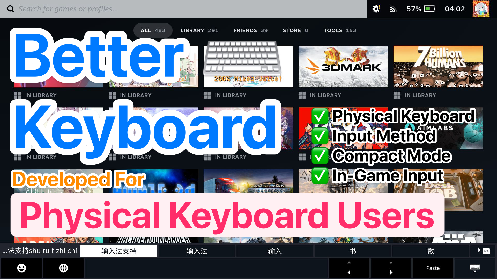

# Better Keyboard

Add support for physical keyboard to the virtual keyboard overlay, to utilize built-in IME, Emoji panel, etc. It can also makes virtual keyboard more compact for easier use for physical keyboard users.

给虚拟键盘添加物理键盘支持，便于使用内置的IME、Emoji面板等。还增加了紧凑模式，便于使用物理键盘。

**Currently only tested with US English keyboard layout and Chinese (Simplified) IME, more testing is needed.**

**目前仅测试了英文键盘和简体中文输入法，还需要更多测试。**

## Installation 安装

*Make sure you have installed [Decky Loader](https://github.com/SteamDeckHomebrew/decky-loader) first.*

**请先确保已安装 [Decky Loader](https://github.com/SteamDeckHomebrew/decky-loader) 。**

Download the latest release from [Releases](https://github.com/chenx-dust/BetterKeyboard/releases/latest) and unzip to `~/homebrew/plugins`.

从 [Releases](https://github.com/chenx-dust/BetterKeyboard/releases/latest) 下载最新版本，并解压到 `~/homebrew/plugins` 。

## Tips & Tricks 技巧提示

- You can click the `Space` virtual key to leave compact mode temporarily.
- You can use `Space` and number keys to accept IME candidates.
- You can short press `LeftShift` key to switch between input methods.

- 可以通过点击 `空格` 键临时退出 `compact mode` 。
- 可以通过 `空格` 和数字键接受输入法候选项。
- 可以通过按住 `左 Shift` 键切换输入法。

## How it Work 工作原理

This plugin uses the step below to work:

1. Hijack the virtual keyboard triggers.
2. Modify the keyboard layout.
3. Use `evdev` to block and receive keyboard events.
4. Send keyboard events to Steam.
5. Map keys to correct actions.

## License

Copyright (c) 2025 Chenx Dust. This project is licensed under the MIT license.

## Acknowledgement

This plugin is using a modified version of [gvalkov/python-evdev](https://github.com/gvalkov/python-evdev). I've removed all the CPython part and make it work out-of-the-box.
